<div align="center">


# QXLI — Private LLM Infrastructure for Enterprises

**Deploy your own sovereign AI stack — private chat interface, intelligent agents, and a RAG knowledge base. Entirely on your infrastructure.**

<br/>

[](https://www.docker.com/)
[](https://www.terraform.io/)
[](https://nginx.org/)
[](https://qdrant.tech/)
[](https://n8n.io/)
[](https://developer.nvidia.com/)
[](https://aws.amazon.com/)
[](https://www.python.org/)
[](https://www.typescriptlang.org/)
[](./LICENSE)

<br/>

> **QXLI** gives any organisation a fully self-hosted, air-gapped-capable AI platform:
> a production-grade chat UI, a programmable agent layer, and a retrieval-augmented generation (RAG) knowledge base — all wired together behind an enterprise-grade reverse proxy with TLS.

</div>

---

## Table of Contents

- [Why QXLI](#why-qxli)
- [Architecture](#architecture)
- [Core Components](#core-components)
  - [QXLI-UI — Chat Interface](#qxli-ui--chat-interface)
  - [n8n — Agent Automation](#n8n--agent-automation)
  - [Qdrant — RAG Knowledge Base](#qdrant--rag-knowledge-base)
  - [NGINX — Reverse Proxy & TLS](#nginx--reverse-proxy--tls)
- [Infrastructure & Deployment](#infrastructure--deployment)
  - [Prerequisites](#prerequisites)
  - [AWS via Terraform](#aws-via-terraform)
  - [GCP Deployment](#gcp-deployment)
  - [NVIDIA Jetson (Edge)](#nvidia-jetson-edge)
- [Quick Start](#quick-start)
- [Configuration](#configuration)
- [GPU Support](#gpu-support)
- [SSL / TLS Setup](#ssl--tls-setup)
- [Optional & Experimental Components](#optional--experimental-components)
- [Security Considerations](#security-considerations)

---

## Why QXLI

| Challenge | QXLI's Answer |
|---|---|
| Data leaves the organisation when using SaaS AI | All inference and storage runs on **your** servers |
| No control over model access or user roles | QXLI-UI ships with fine-grained **role-based access control** |
| Connecting LLMs to internal tools requires custom code | **n8n** provides a no-code/low-code agent and automation layer |
| Knowledge locked in documents and databases | **Qdrant** vector store powers retrieval-augmented generation (RAG) |
| Complex infrastructure to stand up and maintain | One `docker-compose up` with optional **Terraform** provisioning for AWS |
| GPU or edge deployment requirements | First-class support for **NVIDIA CUDA**, **AMD ROCm**, and **Jetson ARM64** |

---

## Architecture

```mermaid
graph TD
    User(["👤 End User / Enterprise Client"])

    subgraph Ingress ["Ingress Layer"]
        NGINX["🔒 NGINX\nReverse Proxy + TLS\nPort 443"]
    end

    subgraph Core ["Core Services"]
        UI["💬 QXLI-UI\nChat Interface\ndemo.qxli.com"]
        N8N["🤖 n8n\nAgent Automation\nagents.qxli.com"]
        QDRANT["🗄️ Qdrant\nVector DB / RAG\nPort 6333"]
    end

    subgraph LLM ["LLM Backend (configurable)"]
        OLLAMA["🦙 Ollama\nLocal Model Runtime\n(optional)"]
        OPENAI["🌐 OpenAI-compatible API\n(any external or private endpoint)"]
    end

    subgraph Infra ["Infrastructure"]
        AWS["☁️ AWS EC2\n(Terraform)"]
        GCP["☁️ GCP\n(A100 GPU)"]
        JETSON["🟢 NVIDIA Jetson\nEdge (ARM64)"]
    end

    User --> NGINX
    NGINX -->|"demo.qxli.com"| UI
    NGINX -->|"agents.qxli.com"| N8N
    UI <--> QDRANT
    UI <--> OLLAMA
    UI <--> OPENAI
    N8N <-->|"Webhook / REST"| UI
    N8N <-->|"External Integrations"| OPENAI

    AWS --> Core
    GCP --> Core
    JETSON --> Core
```



**Request flow:**

1. HTTPS requests arrive at **NGINX** on port 443.
2. Traffic is routed by subdomain — the chat UI on `demo.qxli.com` and agents on `agents.qxli.com`.
3. **QXLI-UI** handles model inference via a configurable LLM backend (local Ollama, any OpenAI-compatible endpoint, or hosted provider).
4. **Qdrant** provides semantic search over enterprise document corpora for RAG queries.
5. **n8n** agents receive webhook triggers and orchestrate multi-step automations across internal tools and external APIs.
6. All services communicate over an isolated Docker bridge network (`web-network`).

---

## Core Components

### QXLI-UI — Chat Interface


A hardened, enterprise-branded fork of [Open WebUI](https://github.com/open-webui/open-webui) — the battle-tested open-source AI chat frontend.

**Key capabilities:**

- **Model-agnostic** — connects to any Ollama model, OpenAI-compatible REST endpoint, Groq, Mistral, and others via a single URL + key pair
- **Role-based access control** — granular user, group, and admin roles with per-model and per-feature permissions
- **Retrieval-Augmented Generation (RAG)** — native document ingestion and semantic retrieval powered by Qdrant
- **Voice & video input** — integrated speech recognition and visual media support
- **Function calling / Pipelines** — extend the UI with custom Python plugins without forking the core
- **Offline-first** — progressive web app (PWA) with no dependency on external CDNs at runtime
- **Image generation** — AUTOMATIC1111 Stable Diffusion and DALL-E compatible interfaces
- **File upload & citation** — up to 500 MB per request; responses cite source documents

```
Image:     aryanvermatechno/qxli-ui:latest   (cloud)
           aryanvermatechno/qxli-ui:arm64    (Jetson / ARM64)
Port:      8080 (internal) → 8888 (host)
Domain:    demo.qxli.com
```

---

### n8n — Agent Automation


[n8n](https://n8n.io/) is the agent orchestration and workflow automation layer. It connects your private LLM to internal tools, databases, and external APIs through a visual, no-code interface — with full code-level control when needed.

**Use cases within QXLI:**

- Build **AI agents** that take action on LLM responses (create tickets, send notifications, query databases)
- Orchestrate **multi-step workflows** triggered by chat events or webhooks
- Connect to **400+ integrations** (Slack, Google Workspace, Salesforce, SQL databases, REST APIs)
- Create **scheduled automations** that run LLM tasks without user interaction
- Expose **custom tools** back into the chat UI for on-demand agent invocation

```
Image:   docker.n8n.io/n8nio/n8n
Port:    5678 (internal)
Domain:  agents.qxli.com
Data:    n8n_data Docker volume
Webhook: https://agents.qxli.com
```

---

### Qdrant — RAG Knowledge Base


[Qdrant](https://qdrant.tech/) is a production-grade, open-source vector search engine that backs all RAG operations in QXLI. It stores document embeddings and enables semantic search across your organisation's private knowledge corpus.

**How it fits in:**

- QXLI-UI automatically ingests uploaded documents into Qdrant as vector embeddings
- At query time, relevant document chunks are retrieved and injected into the LLM prompt as context
- Collections map to isolated knowledge domains (e.g., HR policy, product docs, engineering runbooks)
- REST + gRPC API available for external ingestion pipelines or custom integrations

```
Image:   qdrant/qdrant
Port:    6333
Storage: qdrant_data Docker volume (persistent)
```

---

### NGINX — Reverse Proxy & TLS


NGINX acts as the single ingress point for all QXLI services.

**Configuration highlights:**

| Feature | Value |
|---|---|
| TLS termination | Let's Encrypt certificates (auto-managed) |
| Max upload size | 500 MB |
| Proxy read timeout | 10 minutes (for long LLM responses) |
| WebSocket support | Enabled (for streaming LLM output) |
| Port | 443 (HTTPS only) |

Routing is subdomain-based — each service gets its own domain with independent TLS certificates. See [SSL / TLS Setup](#ssl--tls-setup) for certificate provisioning details.

---

## Infrastructure & Deployment

### Prerequisites

| Requirement | Minimum |
|---|---|
| CPU | 4 cores |
| RAM | 16 GB |
| Disk | 100 GB SSD |
| OS | Ubuntu 22.04 LTS |
| Docker | 24.x |
| Docker Compose | v2.x |
| GPU (optional) | NVIDIA with CUDA 12+ / AMD ROCm 5+ |

Install Docker and Docker Compose on a fresh Ubuntu host:

```bash
curl -fsSL https://get.docker.com | sh
sudo usermod -aG docker $USER
```

---

### AWS via Terraform


The `infra/aws/` directory contains a complete Terraform module that provisions a production-ready EC2 instance with:

- **AMI:** Ubuntu 22.04 LTS (`us-east-1`)
- **Default instance type:** `t2.large` (configurable)
- **Root volume:** 100 GB GP2
- **Networking:** Elastic IP for a stable public address, security groups for SSH/HTTP/HTTPS and configurable application ports
- **User data:** Automatically installs Docker and Docker Compose on first boot

```bash
cd infra/aws

# Initialise Terraform
terraform init

# Review the execution plan
terraform plan

# Provision infrastructure
terraform apply
```

**Key Terraform variables** (`terraform.tfvars`):

```hcl
project          = "qxli"
region           = "us-east-1"
instance_type    = "t2.large"        # override for GPU instances (e.g. g4dn.xlarge)
root_volume_size = 100
vpc_id           = "<your-vpc-id>"
subnet_id        = "<your-subnet-id>"
ssh_public_key_path = "~/.ssh/qxli-aws.pub"
key_pair_name    = "qxli-aws-key"
```

After `apply`, Terraform outputs the Elastic IP and a ready-to-use SSH command:

```
Outputs:
  elastic_ip    = "x.x.x.x"
  ssh_command   = "ssh -i ~/.ssh/qxli-aws ubuntu@x.x.x.x"
```

---

### GCP Deployment


The included `gcp.sh` script provisions a high-GPU instance on Google Cloud Platform optimised for LLM workloads:

- **Machine type:** `a2-highgpu-1g`
- **GPU:** NVIDIA Tesla A100 (40 GB HBM2)
- **Disk:** 100 GB
- **Base image:** Deep Learning VM with CUDA pre-installed
- **Ops Agent:** Enabled for Cloud Monitoring integration

```bash
# Review and set your project/zone variables, then run:
bash gcp.sh
```

---

### NVIDIA Jetson (Edge)


`docker-compose.jetson.yml` provides an ARM64-native stack for edge deployments on NVIDIA Jetson hardware (Orin, AGX, NX). It includes GPU pass-through for local inference:

```bash
docker compose -f docker-compose.jetson.yml up -d
```

All images ship ARM64 variants. Ollama runs natively on the Jetson GPU via the NVIDIA Container Runtime.

---

## Quick Start

### 1. Clone and configure

```bash
git clone https://github.com/qxli-org/qxli.git
cd qxli
cp .env.example .env   # edit with your API keys and domain names
```

### 2. Provision SSL certificates

```bash
# Directories are created by the startup script:
bash startup.sh

# Or manually:
mkdir -p /etc/ssl/demo.qxli.com /etc/ssl/agents.qxli.com
# Then copy your Let's Encrypt / custom certs into each directory
```

### 3. Launch the stack

```bash
docker compose up -d
```

Services come up in the following order:

1. `qdrant` — vector store
2. `qxli-ui` — chat interface
3. `n8n` — agent layer
4. `nginx` — ingress (waits for upstream services)

### 4. Access

| Service | URL |
|---|---|
| Chat Interface | `https://demo.qxli.com` |
| Agent Builder | `https://agents.qxli.com` |
| Qdrant API | `http://localhost:6333` (internal) |

---

## Configuration

### Environment Variables

Copy `.env.example` to `.env` and populate:

```env
# LLM Provider (if using an external endpoint)
OPENAI_API_KEY=sk-...

# Research agent (if enabled)
TAVILY_API_KEY=tvly-...
```

### QXLI-UI settings (`qxli-ui/.env.example`)

```env
OLLAMA_BASE_URL=http://ollama:11434    # local model runtime (if enabled)
OPENAI_API_BASE_URL=                   # any OpenAI-compatible base URL
OPENAI_API_KEY=                        # API key for the above endpoint
CORS_ALLOW_ORIGIN=*
FORWARDED_ALLOW_IPS=*
DO_NOT_TRACK=true
ANONYMIZED_TELEMETRY=false
```

### n8n settings (in `docker-compose.yml`)

```yaml
environment:
  - N8N_HOST=agents.qxli.com
  - N8N_PORT=5678
  - WEBHOOK_URL=https://agents.qxli.com
  - N8N_PROTOCOL=https
```

### Compose overlay files

QXLI-UI ships several optional Docker Compose overlays for specialised deployments:

| Overlay | Purpose |
|---|---|
| `docker-compose.gpu.yaml` | NVIDIA GPU pass-through for Ollama |
| `docker-compose.amdgpu.yaml` | AMD ROCm GPU support |
| `docker-compose.api.yaml` | Expose Ollama API externally |
| `docker-compose.playwright.yaml` | Web scraping and live page loading |
| `docker-compose.data.yaml` | Configurable Ollama data directory |

Apply overlays with `-f`:

```bash
docker compose -f docker-compose.yml -f qxli-ui/docker-compose.gpu.yaml up -d
```

---

## GPU Support


QXLI supports GPU-accelerated inference across all major hardware platforms.

### NVIDIA (CUDA)

Run the GPU setup script to install the NVIDIA Container Toolkit and configure the Docker runtime:

```bash
bash startup.sh
```

Or manually:

```bash
# Install NVIDIA Container Toolkit
curl -fsSL https://nvidia.github.io/libnvidia-container/gpgkey | sudo gpg --dearmor -o /usr/share/keyrings/nvidia-container-toolkit-keyring.gpg
# ... (follow NVIDIA docs for your distro)

# Configure Docker
sudo nvidia-ctk runtime configure --runtime=docker
sudo systemctl restart docker
```

Then launch with the GPU overlay:

```bash
docker compose -f docker-compose.yml -f qxli-ui/docker-compose.gpu.yaml up -d
```

### AMD (ROCm)

```bash
docker compose -f docker-compose.yml -f qxli-ui/docker-compose.amdgpu.yaml up -d
```

The AMD overlay mounts `/dev/kfd` and `/dev/dri` into the Ollama container and sets `HSA_OVERRIDE_GFX_VERSION` for compatibility.

### NVIDIA Jetson

Use the dedicated Jetson compose file — GPU pass-through is pre-configured:

```bash
docker compose -f docker-compose.jetson.yml up -d
```

---

## SSL / TLS Setup

QXLI uses Let's Encrypt certificates. The `startup.sh` script creates the required directory structure. You can manage certificates with `certbot.py` or any compatible ACME client.

**Certificate directory layout expected by NGINX:**

```
/etc/ssl/
├── demo.qxli.com/
│   ├── fullchain.pem
│   └── privkey.pem
└── agents.qxli.com/
    ├── fullchain.pem
    └── privkey.pem
```

For custom internal CA certificates, place them in the same structure and update `nginx.conf` accordingly.

---

## Optional & Experimental Components

The following services are available in the repository but **disabled by default** in the main `docker-compose.yml`. They can be uncommented and enabled for advanced use cases:

| Component | Description | Status |
|---|---|---|
| **Ollama** | Local model runtime for fully air-gapped inference | Available — commented out in compose |
| **NVIDIA NIM** | High-performance GPU inference microservice via NGC | Available — commented out in compose |
| **BeeAI** | AI agent framework integration | Experimental |
| **Langflow** | Visual low-code flow builder for RAG and agents (`qxli-flow/`) | Full module available, disabled in main compose |
| **GPT-Researcher** | Autonomous web and document research agent (`gpt-researcher/`) | Full module available, disabled in main compose |

Each optional component has its own `docker-compose.yml` and documentation within its subdirectory.

---

## Security Considerations

- **Secrets management:** Never commit `.env` files with real credentials. Use AWS Secrets Manager, HashiCorp Vault, or Docker Secrets in production.
- **TLS enforcement:** NGINX is configured for HTTPS-only. Disable HTTP entirely in your security group / firewall rules.
- **Network isolation:** All services communicate over the private `web-network` Docker bridge. Only ports 443 (NGINX) should be publicly reachable.
- **User access control:** QXLI-UI enforces RBAC. Disable public sign-up and configure SSO/LDAP for enterprise identity federation.
- **API key rotation:** Rotate LLM provider keys regularly and restrict them to the minimum required scopes.
- **SSH access:** Restrict `allowed_ssh_cidrs` in `infra/aws/variables.tf` to your organisation's IP ranges.
- **Volume encryption:** Enable EBS encryption in AWS and equivalent disk encryption on GCP / Jetson for data at rest.

---

## Contact

For licensing enquiries, enterprise deployment support, or partnership discussions, reach out to the QXLI team:

**Email:** [tech@qxli.com](mailto:tech@qxli.com)

---

## License

Copyright © 2024–2026 QXLI. All rights reserved.

This software and its source code are proprietary and confidential. Use, reproduction, modification, distribution, or commercial exploitation of any part of this repository — in whole or in part — is strictly prohibited without a written licence agreement from QXLI.

See [LICENSE](./LICENSE) for the full End User Licence Agreement.

---

<div align="center">

Built by **QXLI** — Private AI for the modern enterprise.

[](https://www.docker.com/)
[](https://www.terraform.io/)
[](https://aws.amazon.com/)
[](https://n8n.io/)
[](https://qdrant.tech/)
[](https://nginx.org/)
[](https://developer.nvidia.com/)

</div>
