# Unified SSO Architecture Diagrams

## Current Architecture (Multi-Subdomain)

```mermaid
graph TB
    User[👤 User] 
    
    subgraph "Current Multi-Subdomain Setup"
        DNS[🌐 DNS Router]
        
        subgraph "demo.qxli.com"
            UI[🖥️ qxli-ui<br/>Port 8888<br/>Auth: JWT + OAuth]
        end
        
        subgraph "flow.qxli.com"
            LF[🔄 Langflow<br/>Port 7860<br/>Auth: Superuser]
        end
        
        subgraph "agents.qxli.com"
            N8N[🤖 n8n<br/>Port 5678<br/>Auth: Built-in]
        end
    end
    
    subgraph "Shared Services"
        OLLAMA[🧠 Ollama<br/>Port 11434]
        QDRANT[🗄️ Qdrant<br/>Port 6333]
    end
    
    User --> DNS
    DNS --> UI
    DNS --> LF
    DNS --> N8N
    
    UI --> OLLAMA
    LF --> OLLAMA
    N8N --> OLLAMA
    
    UI --> QDRANT
    LF --> QDRANT
    
    style UI fill:#e1f5fe
    style LF fill:#fff3e0
    style N8N fill:#f3e5f5
    style User fill:#c8e6c9
```



## Proposed Unified SSO Architecture

```mermaid
graph TB
    User[👤 User]
    
    subgraph "Single Domain: qxli.com"
        subgraph "🛡️ SSO Gateway Layer"
            NGINX[🌐 Nginx Reverse Proxy<br/>SSL Termination<br/>Auth Middleware]
        end
        
        subgraph "🔐 Central Authentication"
            AUTH[🔑 qxli-ui Auth Service<br/>JWT Provider<br/>Session Manager<br/>User Management]
        end
        
        subgraph "📱 Application Layer"
            MAIN[🖥️ Main App<br/>qxli.com/]
            FLOW[🔄 Langflow<br/>qxli.com/flow/*]
            AGENTS[🤖 n8n<br/>qxli.com/agents/*]
        end
        
        subgraph "🔧 Backend Services"
            OLLAMA[🧠 Ollama LLM]
            QDRANT[🗄️ Qdrant Vector DB]
        end
    end
    
    User --> NGINX
    NGINX --> AUTH
    AUTH --> MAIN
    AUTH --> FLOW
    AUTH --> AGENTS
    
    MAIN --> OLLAMA
    FLOW --> OLLAMA
    AGENTS --> OLLAMA
    
    MAIN --> QDRANT
    FLOW --> QDRANT
    
    style User fill:#c8e6c9
    style NGINX fill:#ffcdd2
    style AUTH fill:#fff59d
    style MAIN fill:#e1f5fe
    style FLOW fill:#fff3e0
    style AGENTS fill:#f3e5f5
```



## Authentication Flow


## Docker Container Architecture

```mermaid
graph TB
    subgraph "🐳 Unified Docker Container"
        subgraph "🔄 Process Manager (Supervisord)"
            PM[Process Orchestrator]
        end
        
        subgraph "🌐 Web Layer"
            NGINX_C[Nginx<br/>Port 443/80]
        end
        
        subgraph "🖥️ Application Services"
            UI_C[qxli-ui<br/>Internal: 8080<br/>External: /]
            LF_C[Langflow<br/>Internal: 7860<br/>External: /flow]
            N8N_C[n8n<br/>Internal: 5678<br/>External: /agents]
        end
        
        subgraph "🗄️ Data Services"
            OLLAMA_C[Ollama<br/>Internal: 11434]
            QDRANT_C[Qdrant<br/>Internal: 6333]
        end
        
        subgraph "💾 Shared Storage"
            DATA[/shared-data]
            CONFIG[/shared-config]
            LOGS[/shared-logs]
        end
    end
    
    PM --> NGINX_C
    PM --> UI_C
    PM --> LF_C
    PM --> N8N_C
    PM --> OLLAMA_C
    PM --> QDRANT_C
    
    NGINX_C --> UI_C
    NGINX_C --> LF_C
    NGINX_C --> N8N_C
    
    UI_C --> OLLAMA_C
    LF_C --> OLLAMA_C
    N8N_C --> OLLAMA_C
    
    UI_C --> QDRANT_C
    LF_C --> QDRANT_C
    
    UI_C --> DATA
    LF_C --> DATA
    N8N_C --> DATA
    
    UI_C --> CONFIG
    LF_C --> CONFIG
    N8N_C --> CONFIG
    
    style PM fill:#e8f5e8
    style NGINX_C fill:#ffcdd2
    style UI_C fill:#e1f5fe
    style LF_C fill:#fff3e0
    style N8N_C fill:#f3e5f5
```

## Service Integration Patterns


## Deployment Strategy

```mermaid
flowchart TD
    START([Start Migration]) --> PHASE1[Phase 1: Central Auth<br/>2 weeks]
    
    PHASE1 --> P1_TASKS[• Enhance qxli-ui auth<br/>• JWT token service<br/>• User management APIs<br/>• Service scopes]
    
    P1_TASKS --> PHASE2[Phase 2: Service Integration<br/>2 weeks]
    
    PHASE2 --> P2_TASKS[• Langflow JWT integration<br/>• n8n external auth<br/>• Auth middleware<br/>• Cross-service testing]
    
    P2_TASKS --> PHASE3[Phase 3: Unified Routing<br/>1 week]
    
    PHASE3 --> P3_TASKS[• Nginx path routing<br/>• Auth request validation<br/>• SSL single domain<br/>• E2E testing]
    
    P3_TASKS --> PHASE4[Phase 4: Docker Unification<br/>1 week]
    
    PHASE4 --> P4_TASKS[• Unified Dockerfile<br/>• Process management<br/>• Service discovery<br/>• Health checks]
    
    P4_TASKS --> PHASE5[Phase 5: Production<br/>1 week]
    
    PHASE5 --> P5_TASKS[• DNS migration<br/>• Container deployment<br/>• Performance monitoring<br/>• User acceptance]
    
    P5_TASKS --> END([Production Ready])
    
    style START fill:#c8e6c9
    style END fill:#c8e6c9
    style PHASE1 fill:#fff59d
    style PHASE2 fill:#fff59d
    style PHASE3 fill:#fff59d
    style PHASE4 fill:#fff59d
    style PHASE5 fill:#fff59d
```



## Network & Security Architecture

```mermaid
graph TB
    subgraph "🌐 External Network"
        INTERNET[Internet]
        CDN[CDN/CloudFlare<br/>Optional]
    end
    
    subgraph "🛡️ Security Layer"
        FIREWALL[Firewall]
        SSL[SSL/TLS Termination]
        WAF[Web Application Firewall<br/>Optional]
    end
    
    subgraph "🏠 Internal Network"
        LB[Load Balancer<br/>Optional]
        
        subgraph "📦 Docker Network"
            PROXY[Nginx Proxy<br/>443:443]
            
            subgraph "🔐 Auth Network"
                AUTH_SVC[Auth Service<br/>qxli-ui]
                SESSION_STORE[Session Store<br/>Redis/Memory]
            end
            
            subgraph "📱 App Network"
                APP1[Main App]
                APP2[Langflow]
                APP3[n8n]
            end
            
            subgraph "💽 Data Network"
                DB1[Ollama]
                DB2[Qdrant]
            end
        end
    end
    
    INTERNET --> CDN
    CDN --> FIREWALL
    FIREWALL --> SSL
    SSL --> WAF
    WAF --> LB
    LB --> PROXY
    
    PROXY --> AUTH_SVC
    AUTH_SVC --> SESSION_STORE
    
    PROXY --> APP1
    PROXY --> APP2
    PROXY --> APP3
    
    APP1 --> DB1
    APP2 --> DB1
    APP3 --> DB1
    
    APP1 --> DB2
    APP2 --> DB2
    
    AUTH_SVC --> APP1
    AUTH_SVC --> APP2
    AUTH_SVC --> APP3
    
    style INTERNET fill:#e3f2fd
    style FIREWALL fill:#ffcdd2
    style SSL fill:#c8e6c9
    style AUTH_SVC fill:#fff59d
    style SESSION_STORE fill:#f8bbd9
```

